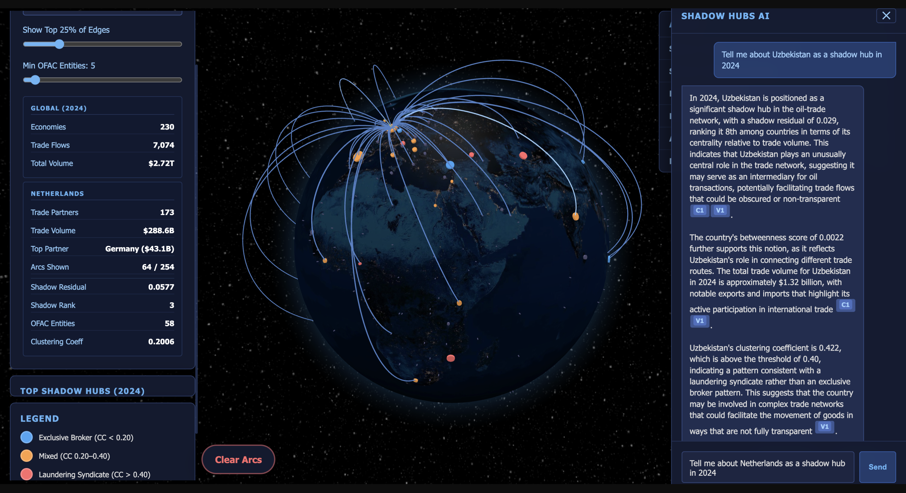

# 🛢️ Shadow Hubs in Global Oil Trade

**Network Analytics & Sanctions Overlay · GraphRAG-Powered Intelligence**

A multi-layer analysis of illicit oil trade networks combining OFAC sanctions data, UN Comtrade bilateral flows (2019–2024), graph-theoretic "shadow hub" detection, and an AI-powered Graph RAG system for natural-language querying. Built as a final project for *Social Media & Network Analytics — Spring 2026*.


> **[Launch the live app →](https://shadow-hubs.onrender.com)** — Interactive 3D globe with AI chat, clustering analysis, and real-time edge filtering.

> **Shadow hubs** are countries whose betweenness centrality in the oil trade network is anomalously high relative to their trade volume — structurally positioned as intermediaries in ways that merit further investigation for potential sanctions circumvention.

---

## 🌐 Live Demos

| Demo | Description |
|------|-------------|
| **[Interactive Globe + AI Chat →](https://shadow-hubs.onrender.com)** | Full experience: 3D globe with GraphRAG chat panel. Ask questions about shadow hubs, sanctions, and trade patterns. |
| **[Globe Only (GitHub Pages) →](https://ahmerrill.github.io/shadow-hubs/viz/globe_viz.html)** | Lightweight 3D globe visualization — no AI chat, runs entirely client-side. |

---

## ✨ Features

- **3D Globe Visualization** — Globe.gl-rendered earth with 230 economies as interactive dots, colored by OFAC sanctions exposure, sized by shadow hub rank
- **GraphRAG AI Chat** — Ask natural-language questions about shadow hubs, sanctions, and trade patterns; powered by LangGraph + GPT-4o-mini + Neo4j
- **Edge Percentage Slider** — Dynamically filter trade arcs from 5% to 100% (by value) when viewing a country's flows; default shows top 25%
- **Clustering Analysis** — Interactive Chart.js bubble chart classifying shadow hubs as Exclusive Brokers, Mixed, or Laundering Syndicates using weighted clustering coefficients
- **Clustered / Raw Leaderboard** — Toggle between clustering-filtered and raw shadow hub rankings
- **Collapsible About Panel** — Accordion-style sections explaining methodology, data sources, and how to fork the project
- **UptimeRobot Keep-Alive** — Prevents Render free-tier cold starts with 5-minute HEAD pings

---

## 📂 Repository Structure

```
shadow-hubs/
├── README.md
├── .env.example                  ← credential template (copy to .env)
├── .gitignore
├── data/
│   ├── edges_country_oil_2019plus.csv      (45K directed trade flows)
│   ├── nodes_country_oil_2019plus.csv      (232 countries with OFAC counts)
│   ├── ofac_country_agg.csv                (OFAC entity aggregation)
│   └── shadow_hubs_residual_2019plus.csv   (413 shadow hub scores)
├── notebooks/
│   ├── SMA-Final_Project.ipynb             (main analysis notebook)
│   ├── network_analysis.ipynb              (clustering coefficient analysis)
│   └── auradb_load.cypher                  (Neo4j load scripts + demo queries)
├── viz/
│   ├── globe_viz.html                      (standalone 3D globe for GitHub Pages)
│   ├── VISUALIZATION_README.md             (globe technical docs)
│   ├── network_viz_2024.png
│   └── network_viz_2024_light.png
├── backend/
│   ├── Dockerfile                          (container config for Render)
│   ├── requirements.txt                    (Python dependencies)
│   ├── main.py                             (FastAPI app — serves globe + /ask API)
│   ├── graphrag_helpers/
│   │   ├── __init__.py
│   │   └── graphrag_langgraph.py           (enhanced GraphRAG with 9 intents)
│   └── static/
│       ├── index.html                      (3D globe, chat panel, leaderboard, edge slider)
│       ├── clustering.html                 (interactive clustering bubble chart per year)
│       └── data/
│           ├── countries.json              (230 economies with lat/lon/OFAC)
│           ├── shadow_hubs.json            (413 shadow hub scores)
│           ├── edges.json                  (45K trade flows for arc rendering)
│           └── clustering_data.json        (weighted clustering coefficients)
├── GraphRAG/                               (original GraphRAG prototype by Stiles)
│   ├── RAG_driver.ipynb
│   └── graphrag_helpers/
└── docs/
    ├── Data dictionary - SMA Final Project.docx
    └── HANDOFF README- Final Project.docx
```

---

## 🤖 GraphRAG Architecture

The AI chat is powered by a **LangGraph workflow** with hybrid retrieval:

```
User Question → Plan (classify intent) → Retrieve (Cypher + Vector) → Draft Answer → Evaluate → Finalize
```

**9 question intents** with specialized Cypher queries:

| Intent | Example Question |
|--------|-----------------|
| `hub_partners` | "Who are Singapore's top trade partners in 2024?" |
| `shadow_explanation` | "What makes the USA the top shadow hub?" |
| `top_shadow_hubs` | "Rank the top 10 shadow hubs in 2024" |
| `emerging_hubs` | "Which countries grew as shadow hubs after 2022?" |
| `clustering_analysis` | "How does Singapore move oil? Is it a broker?" |
| `sanctions_hubs` | "Which sanctioned countries are also shadow hubs?" |
| `temporal_trend` | "How has Spain's shadow rank changed over time?" |
| `comparative` | "Compare Singapore and Georgia" |
| `general` | Anything else |

**Conceptual knowledge base** includes embedded explanations of: shadow hub theory, betweenness centrality, the regression ceiling (why USA ranks #1), OFAC enforcer bias, the post-2022 sanctions shockwave, and the exclusive broker vs. laundering syndicate clustering patterns.

**Cost:** ~$0.001 per query using OpenAI gpt-4o-mini. Even 1,000 queries costs ~$1.

---

## 🚀 Quick Links

| Resource | Link |
|----------|------|
| **Full Demo (Globe + AI)** | [Launch on Render](https://shadow-hubs.onrender.com) |
| **Globe Only** | [Launch on GitHub Pages](https://ahmerrill.github.io/shadow-hubs/viz/globe_viz.html) |
| **Analysis Notebook** | [](https://colab.research.google.com/github/AHMerrill/shadow-hubs/blob/main/notebooks/SMA-Final_Project.ipynb) |
| **Presentation** | [View in Canva](https://www.canva.com/d/V20Mq3zMpjkJAd2) |
| **Neo4j Load Scripts** | [`notebooks/auradb_load.cypher`](notebooks/auradb_load.cypher) |
| **Data Dictionary** | [`docs/Data dictionary - SMA Final Project.docx`](docs/Data%20dictionary%20-%20SMA%20Final%20Project.docx) |

---

## 🔬 Methodology

### Data Pipeline

1. **OFAC SDN List** — Parsed the U.S. Treasury's Specially Designated Nationals list, aggregating sanctioned entities by country jurisdiction.

2. **UN Comtrade** — Pulled bilateral oil trade flows (HS 2709–2710) for 230+ countries across 2019–2024 via the Comtrade API.

3. **Network Construction** — Built directed weighted graphs per year, pruned noise edges, computed betweenness centrality, degree, and total trade volume per node.

4. **Shadow Hub Detection** — Regressed log-betweenness on log-volume; countries with high positive residuals are structurally positioned as intermediaries beyond what their trade volume would predict.

5. **Clustering Analysis** — Computed weighted clustering coefficients (`nx.clustering(G, weight='log_weight')`) for all countries across all years. Low clustering (< 0.20) = exclusive broker acting as a lone bridge between disconnected groups (e.g., Singapore 0.18); high clustering (> 0.40) = laundering syndicate with dense internal trade among partners (e.g., Georgia 0.45, Uzbekistan 0.42).

### Graph Database

All data loaded into **Neo4j AuraDB** for Cypher-based querying:

- **232** Country nodes with OFAC metadata
- **45,513** directed TRADE edges (year-partitioned)
- **413** SHADOW_HUB relationships with betweenness, shadow residual, rank, trade volume, and clustering coefficients

---

## 🛠️ Setup

### Deploy the Full App (Render + Docker)

1. Fork this repo
2. Create a new **Web Service** on [Render](https://render.com)
3. Connect your GitHub repo, set root directory to `backend/`
4. Choose **Docker** as the environment
5. Add environment variables:
   - `NEO4J_URI` — your AuraDB connection URI
   - `NEO4J_USERNAME` — AuraDB username
   - `NEO4J_PASSWORD` — AuraDB password
   - `NEO4J_DATABASE` — AuraDB database name
   - `OPENAI_API_KEY` — your OpenAI API key
6. Deploy

### Run Locally

```bash
cd backend
cp ../.env.example .env  # Edit with your credentials
pip install -r requirements.txt
uvicorn main:app --reload
# Open http://localhost:8000
```

### Neo4j Setup

1. Create a free AuraDB instance at [console.neo4j.io](https://console.neo4j.io)
2. Add credentials to `.env`
3. Run the Cypher scripts in [`auradb_load.cypher`](notebooks/auradb_load.cypher)

---

## 📊 Key Datasets

| File | Rows | Description |
|------|------|-------------|
| `edges_country_oil_2019plus.csv` | 45,513 | Directed oil trade flows (exporter → importer, USD value, by year) |
| `nodes_country_oil_2019plus.csv` | 232 | Countries with ISO codes, OFAC entity counts |
| `ofac_country_agg.csv` | 177 | OFAC sanctions entity aggregation by country |
| `shadow_hubs_residual_2019plus.csv` | 413 | Shadow hub scores: betweenness, residual, rank, trade volume |

---

## 👥 Team

Keerti Rawat · Muskan Khepar · Nikhil Kumar · Stiles Clements · Zan Merrill

**Course:** Social Media & Network Analytics — Spring 2026

---

## 📝 License

Academic project — created for educational analysis of global oil trade networks. Uses [Globe.gl](https://github.com/vasturiano/globe.gl) (MIT License) and [three-globe](https://github.com/vasturiano/three-globe) (MIT License).
